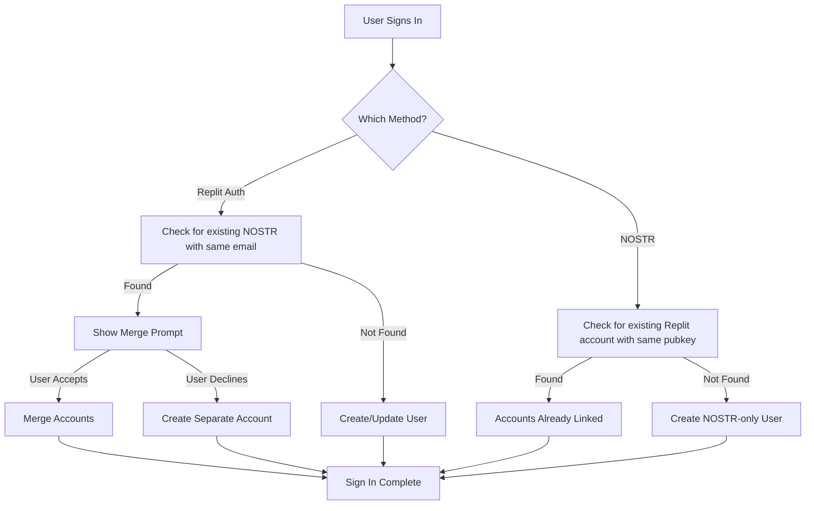

# Universal :-] Authentication Integration Guide

This document provides implementation instructions for adding universal :-] login to CHB ecosystem apps.

## Scope & Implementation Status

### Implemented on colonhyphenbracket.pink (Corporate Site):
- ✅ **Custom Email/Password Auth** - Standalone registration and login (no third-party account required)
- ✅ **NOSTR Authentication** - NIP-07 challenge-response flow
- ✅ **Dual-Path Signup Page** - Email as primary, NOSTR as alternative
- ✅ **PostgreSQL Session Storage** - Secure sessions with connect-pg-simple
- ✅ **bcrypt Password Hashing** - 12 salt rounds for security

### Reference Guide for Other CHB Apps:
The sections below on **Account Linking**, **Migration**, and **Conflict Resolution** provide copy-paste code examples for apps like Hash, Semi, and Pipes to implement. These advanced features are documented for ecosystem consistency but are not all implemented on the corporate site itself.

---

## Overview

Universal :-] authentication supports **two authentication methods**:

1. **Email/Password** (Primary) - Custom standalone auth that works for anyone with an email address. No third-party accounts required. Best for maximum user reach.
2. **NOSTR (NIP-07)** (Alternative) - Cryptographic identity for privacy-focused users. Requires browser extension (Alby, nos2x).

Both methods create a unified user profile in our system, allowing users to access all CHB apps with one identity.

### Key Benefits
- **One identity, all apps**: Users authenticate once across the entire CHB ecosystem
- **No account barriers**: Email/password works for anyone - no Replit, Google, or GitHub account needed
- **Multiple auth options**: Email/password for mainstream users, NOSTR for privacy enthusiasts
- **Context persistence**: User preferences and AI context follow them everywhere
- **Privacy first**: Passwords are hashed with bcrypt, we never store plaintext

---

## Quick Start

### For New Apps

1. **Add Email/Password Auth** - See [Email/Password Auth Setup](#emailpassword-auth-setup)
2. **Optionally add NOSTR** - See [NOSTR Auth Setup](#nostr-auth-setup)
3. **Link accounts** (Advanced) - Allow users to connect both methods to one profile

### For Existing Apps (Migration)

See [Migration Guide for Existing Users](#migration-guide-for-existing-users)

---

## Email/Password Auth Setup

Custom email/password authentication that works for any user with an email address.

### 1. Install Dependencies

```bash
npm install bcrypt express-session connect-pg-simple
npm install --save-dev @types/bcrypt @types/connect-pg-simple @types/express-session
```

### 2. Database Schema

Add to `shared/schema.ts`:

```typescript
import { sql } from "drizzle-orm";
import { pgTable, varchar, timestamp, jsonb, index, boolean } from "drizzle-orm/pg-core";
import { createInsertSchema } from "drizzle-zod";
import { z } from "zod";

// Session storage for express-session
export const sessions = pgTable(
  "sessions",
  {
    sid: varchar("sid").primaryKey(),
    sess: jsonb("sess").notNull(),
    expire: timestamp("expire").notNull(),
  },
  (table) => [index("IDX_session_expire").on(table.expire)],
);

// User storage - supports both Email/Password and NOSTR
export const users = pgTable("users", {
  id: varchar("id").primaryKey().default(sql`gen_random_uuid()`),
  email: varchar("email").unique(),
  passwordHash: varchar("password_hash"), // bcrypt hash
  emailVerified: boolean("email_verified").default(false),
  firstName: varchar("first_name"),
  lastName: varchar("last_name"),
  profileImageUrl: varchar("profile_image_url"),
  nostrPubkey: varchar("nostr_pubkey").unique(), // For NOSTR linking
  nostrNpub: varchar("nostr_npub"),
  createdAt: timestamp("created_at").defaultNow(),
  updatedAt: timestamp("updated_at").defaultNow(),
});

export type User = typeof users.$inferSelect;

// Zod schemas for validation
export const registerUserSchema = z.object({
  email: z.string().email("Please enter a valid email"),
  password: z.string().min(8, "Password must be at least 8 characters"),
  firstName: z.string().optional(),
  lastName: z.string().optional(),
});

export const loginUserSchema = z.object({
  email: z.string().email("Please enter a valid email"),
  password: z.string().min(1, "Password is required"),
});

export type RegisterUserInput = z.infer<typeof registerUserSchema>;
export type LoginUserInput = z.infer<typeof loginUserSchema>;
```

### 3. Server Auth Module

Create `server/email-auth.ts`:

```typescript
import bcrypt from "bcrypt";
import session from "express-session";
import type { Express, RequestHandler } from "express";
import connectPg from "connect-pg-simple";
import { storage } from "./storage";
import { registerUserSchema, loginUserSchema } from "@shared/schema";

const SALT_ROUNDS = 12;

export function getSession() {
  const sessionTtl = 7 * 24 * 60 * 60 * 1000; // 1 week
  const pgStore = connectPg(session);
  const sessionStore = new pgStore({
    conString: process.env.DATABASE_URL,
    createTableIfMissing: false,
    ttl: sessionTtl,
    tableName: "sessions",
  });
  return session({
    secret: process.env.SESSION_SECRET!,
    store: sessionStore,
    resave: false,
    saveUninitialized: false,
    cookie: {
      httpOnly: true,
      secure: process.env.NODE_ENV === "production",
      maxAge: sessionTtl,
      sameSite: "lax",
    },
  });
}

export async function hashPassword(password: string): Promise<string> {
  return bcrypt.hash(password, SALT_ROUNDS);
}

export async function verifyPassword(password: string, hash: string): Promise<boolean> {
  return bcrypt.compare(password, hash);
}

export async function setupEmailAuth(app: Express) {
  app.set("trust proxy", 1);
  app.use(getSession());

  // Registration endpoint
  app.post("/api/auth/register", async (req, res) => {
    try {
      const parseResult = registerUserSchema.safeParse(req.body);
      if (!parseResult.success) {
        return res.status(400).json({
          success: false,
          error: "Validation failed",
          details: parseResult.error.errors.map(e => e.message),
        });
      }

      const { email, password, firstName, lastName } = parseResult.data;
      const normalizedEmail = email.toLowerCase().trim();

      // Check if user already exists
      const existingUser = await storage.getUserByEmail(normalizedEmail);
      if (existingUser) {
        return res.status(409).json({
          success: false,
          error: "An account with this email already exists",
        });
      }

      // Hash password and create user
      const passwordHash = await hashPassword(password);
      const user = await storage.createUser({
        email: normalizedEmail,
        passwordHash,
        firstName: firstName || null,
        lastName: lastName || null,
        emailVerified: false,
      });

      // Set session
      (req.session as any).userId = user.id;

      res.json({
        success: true,
        user: {
          id: user.id,
          email: user.email,
          firstName: user.firstName,
          lastName: user.lastName,
        },
      });
    } catch (error) {
      console.error("Registration error:", error);
      res.status(500).json({
        success: false,
        error: "Registration failed. Please try again.",
      });
    }
  });

  // Login endpoint
  app.post("/api/auth/login", async (req, res) => {
    try {
      const parseResult = loginUserSchema.safeParse(req.body);
      if (!parseResult.success) {
        return res.status(400).json({
          success: false,
          error: "Validation failed",
          details: parseResult.error.errors.map(e => e.message),
        });
      }

      const { email, password } = parseResult.data;
      const normalizedEmail = email.toLowerCase().trim();

      const user = await storage.getUserByEmail(normalizedEmail);
      if (!user || !user.passwordHash) {
        return res.status(401).json({
          success: false,
          error: "Invalid email or password",
        });
      }

      const isValid = await verifyPassword(password, user.passwordHash);
      if (!isValid) {
        return res.status(401).json({
          success: false,
          error: "Invalid email or password",
        });
      }

      (req.session as any).userId = user.id;

      res.json({
        success: true,
        user: {
          id: user.id,
          email: user.email,
          firstName: user.firstName,
          lastName: user.lastName,
        },
      });
    } catch (error) {
      console.error("Login error:", error);
      res.status(500).json({
        success: false,
        error: "Login failed. Please try again.",
      });
    }
  });

  // Logout endpoint
  app.post("/api/auth/logout", (req, res) => {
    req.session.destroy((err) => {
      if (err) {
        console.error("Logout error:", err);
        return res.status(500).json({
          success: false,
          error: "Logout failed",
        });
      }
      res.clearCookie("connect.sid");
      res.json({ success: true });
    });
  });

  // Get current user endpoint
  app.get("/api/auth/user", async (req, res) => {
    try {
      const userId = (req.session as any)?.userId;
      if (!userId) {
        return res.json(null);
      }

      const user = await storage.getUser(userId);
      if (!user) {
        return res.json(null);
      }

      res.json({
        id: user.id,
        email: user.email,
        firstName: user.firstName,
        lastName: user.lastName,
        emailVerified: user.emailVerified,
      });
    } catch (error) {
      console.error("Get user error:", error);
      res.json(null);
    }
  });
}

export const isAuthenticated: RequestHandler = async (req, res, next) => {
  const userId = (req.session as any)?.userId;
  if (!userId) {
    return res.status(401).json({ message: "Unauthorized" });
  }

  const user = await storage.getUser(userId);
  if (!user) {
    return res.status(401).json({ message: "Unauthorized" });
  }

  (req as any).user = user;
  next();
};
```

### 4. Storage Methods

Add these methods to your storage interface:

```typescript
// server/storage.ts
async getUserByEmail(email: string): Promise<User | null> {
  const [user] = await db.select().from(users).where(eq(users.email, email));
  return user || null;
}

async createUser(userData: {
  email: string;
  passwordHash: string;
  firstName?: string | null;
  lastName?: string | null;
  emailVerified?: boolean;
}): Promise<User> {
  const [user] = await db.insert(users).values(userData).returning();
  return user;
}
```

### 5. Add Routes

In `server/routes.ts`:

```typescript
import { setupEmailAuth, isAuthenticated } from "./email-auth";

export async function registerRoutes(app: Express): Promise<Server> {
  await setupEmailAuth(app);
  
  // Protected routes example
  app.get('/api/protected', isAuthenticated, (req: any, res) => {
    res.json({ user: req.user });
  });
  
  // ... other routes
}
```

### 6. Client Hook

Create `client/src/hooks/useAuth.ts`:

```typescript
import { useQuery } from "@tanstack/react-query";
import type { User } from "@shared/schema";

export function useAuth() {
  const { data: user, isLoading, error, refetch } = useQuery<User | null>({
    queryKey: ["/api/auth/user"],
    retry: false,
  });

  return {
    user: user ?? null,
    isLoading,
    isAuthenticated: !!user,
    error,
    refetch,
  };
}
```

### 7. Environment Variables

Required environment variables:
- `DATABASE_URL` - PostgreSQL connection string
- `SESSION_SECRET` - Secret for session encryption (generate a random 32+ character string)

---

## NOSTR Auth Setup

NOSTR provides cryptographic authentication for privacy-focused users.

### 1. Install Dependencies

```bash
npm install nostr-tools
```

### 2. Server Auth Module

Create `server/nostr-auth.ts`:

```typescript
import { randomBytes, scrypt } from 'crypto';
import { promisify } from 'util';
import { verifyEvent, nip19 } from 'nostr-tools';

const scryptAsync = promisify(scrypt);
const CHALLENGE_TTL_MS = 5 * 60 * 1000;
const SESSION_EXPIRY_MS = 7 * 24 * 60 * 60 * 1000;

const challenges = new Map();
const sessions = new Map();
const users = new Map();

export function generateChallenge() {
  const challenge = randomBytes(32).toString('hex');
  const sessionKey = randomBytes(16).toString('hex');
  challenges.set(sessionKey, { challenge, expiresAt: Date.now() + CHALLENGE_TTL_MS });
  return { challenge, sessionKey };
}

export async function verifyNostrLogin(sessionKey: string, pubkey: string, signedEvent: any) {
  const stored = challenges.get(sessionKey);
  if (!stored || Date.now() > stored.expiresAt) {
    return { success: false, error: 'Challenge expired' };
  }
  
  if (signedEvent.content !== stored.challenge) {
    return { success: false, error: 'Challenge mismatch' };
  }
  
  const isValid = verifyEvent(signedEvent);
  if (!isValid) {
    return { success: false, error: 'Invalid signature' };
  }
  
  challenges.delete(sessionKey);
  
  const npub = nip19.npubEncode(pubkey);
  let user = users.get(pubkey);
  if (!user) {
    user = { pubkey, npub, createdAt: Date.now() };
    users.set(pubkey, user);
  }
  
  const sessionId = randomBytes(32).toString('hex');
  sessions.set(sessionId, {
    pubkey,
    npub,
    expiresAt: Date.now() + SESSION_EXPIRY_MS,
  });
  
  return { success: true, sessionId, user };
}

export function validateSession(sessionId: string) {
  const session = sessions.get(sessionId);
  if (!session || Date.now() > session.expiresAt) {
    sessions.delete(sessionId);
    return null;
  }
  return session;
}

export function logout(sessionId: string) {
  sessions.delete(sessionId);
}

export function getUser(pubkey: string) {
  return users.get(pubkey);
}
```

### 3. Add NOSTR Routes

```typescript
app.get("/api/nostr/challenge", (req, res) => {
  const { challenge, sessionKey } = generateChallenge();
  res.json({ success: true, challenge, sessionKey, expiresIn: 300 });
});

app.post("/api/nostr/login", async (req, res) => {
  const { sessionKey, pubkey, signedEvent } = req.body;
  const result = await verifyNostrLogin(sessionKey, pubkey, signedEvent);
  if (!result.success) {
    return res.status(401).json(result);
  }
  res.json(result);
});

app.get("/api/nostr/session", (req, res) => {
  const sessionId = req.headers.authorization?.replace('Bearer ', '');
  const session = validateSession(sessionId!);
  if (!session) {
    return res.status(401).json({ success: false });
  }
  res.json({ success: true, user: getUser(session.pubkey) });
});

app.post("/api/nostr/logout", (req, res) => {
  const sessionId = req.headers.authorization?.replace('Bearer ', '');
  if (sessionId) logout(sessionId);
  res.json({ success: true });
});
```

### 4. Client Library

Create `client/src/lib/nostr.ts`:

```typescript
export function hasNostrExtension(): boolean {
  return typeof window !== 'undefined' && !!(window as any).nostr;
}

export async function getPublicKey(): Promise<string | null> {
  if (!hasNostrExtension()) return null;
  try {
    return await (window as any).nostr.getPublicKey();
  } catch {
    return null;
  }
}

export async function signEvent(event: any): Promise<any | null> {
  if (!hasNostrExtension()) return null;
  try {
    return await (window as any).nostr.signEvent(event);
  } catch {
    return null;
  }
}

export async function login(): Promise<any | null> {
  if (!hasNostrExtension()) return null;
  
  const challengeRes = await fetch('/api/nostr/challenge');
  const { challenge, sessionKey } = await challengeRes.json();
  
  const pubkey = await getPublicKey();
  if (!pubkey) return null;
  
  const event = {
    kind: 22242,
    created_at: Math.floor(Date.now() / 1000),
    tags: [['challenge', challenge]],
    content: challenge,
    pubkey
  };
  
  const signedEvent = await signEvent(event);
  if (!signedEvent) return null;
  
  const loginRes = await fetch('/api/nostr/login', {
    method: 'POST',
    headers: { 'Content-Type': 'application/json' },
    body: JSON.stringify({ sessionKey, pubkey, signedEvent })
  });
  
  const data = await loginRes.json();
  if (data.success) {
    localStorage.setItem('nostr_session', JSON.stringify({
      sessionId: data.sessionId,
      expiresAt: Date.now() + 7 * 24 * 60 * 60 * 1000
    }));
  }
  
  return data;
}
```

---

## Migration Guide for Existing Users

> **Note**: This section provides reference implementation code for CHB ecosystem apps. The corporate site (colonhyphenbracket.pink) implements basic dual-auth but not the full account-linking and migration flows described here.

If your app has existing users with local accounts, follow these detailed steps to enable universal :-] login while preserving all existing data.

### Overview: Migration Scenarios

Your app may have one of these scenarios:

| Scenario | Current State | Migration Path |
|----------|--------------|----------------|
| **A** | NOSTR-only users | Add Replit Auth, offer linking |
| **B** | Local accounts (email/password) | Add Replit Auth, migrate users |
| **C** | Fresh start | Implement both auth methods |

---

### Step 1: Schema Updates for Account Linking

Update your database schema to support both auth methods:

```typescript
// shared/schema.ts
import { sql } from "drizzle-orm";
import { pgTable, varchar, timestamp, jsonb, index, boolean } from "drizzle-orm/pg-core";

export const users = pgTable("users", {
  // Primary identifier (use Replit Auth sub claim as ID)
  id: varchar("id").primaryKey().default(sql`gen_random_uuid()`),
  
  // Replit Auth fields
  email: varchar("email").unique(),
  firstName: varchar("first_name"),
  lastName: varchar("last_name"),
  profileImageUrl: varchar("profile_image_url"),
  
  // NOSTR linking fields
  nostrPubkey: varchar("nostr_pubkey").unique(),
  nostrNpub: varchar("nostr_npub"),
  
  // Legacy account linking (if migrating from local auth)
  legacyUserId: varchar("legacy_user_id").unique(),
  
  // Migration tracking
  migratedAt: timestamp("migrated_at"),
  authMethods: jsonb("auth_methods").default(['replit']), // ['replit', 'nostr']
  
  createdAt: timestamp("created_at").defaultNow(),
  updatedAt: timestamp("updated_at").defaultNow(),
});
```

Run migration:
```bash
npm run db:push --force
```

---

### Step 2: Storage Layer for Account Linking

Add the complete storage interface with full method implementations:

```typescript
// server/storage.ts
import { eq, and, isNull, sql } from 'drizzle-orm';
import { db } from './db';
import { users, legacyUsers, User, UpsertUser } from '@shared/schema';

export interface IStorage {
  // Core user operations
  getUser(id: string): Promise<User | null>;
  upsertUser(user: UpsertUser): Promise<User>;
  
  // Multi-auth lookup methods
  getUserByEmail(email: string): Promise<User | null>;
  getUserByNostrPubkey(pubkey: string): Promise<User | null>;
  getUserByLegacyId(legacyId: string): Promise<User | null>;
  
  // Account linking (transactional)
  linkNostrToUser(userId: string, pubkey: string, npub: string): Promise<{ success: boolean; error?: string }>;
  linkLegacyAccount(userId: string, legacyId: string): Promise<{ success: boolean; error?: string }>;
  unlinkNostr(userId: string): Promise<void>;
  
  // Migration utilities
  migrateUserData(legacyId: string, newUserId: string): Promise<void>;
  getUserAuthMethods(userId: string): Promise<string[]>;
  
  // Conflict detection
  checkLinkingConflicts(userId: string, email?: string, pubkey?: string): Promise<ConflictResult[]>;
}

interface ConflictResult {
  type: 'NOSTR_EXISTS' | 'EMAIL_EXISTS' | 'LEGACY_EXISTS';
  conflictingUserId: string;
  resolution: 'merge' | 'choose' | 'skip';
}

export class DatabaseStorage implements IStorage {
  
  // ========== Core User Operations ==========
  
  async getUser(id: string): Promise<User | null> {
    const [user] = await db.select().from(users).where(eq(users.id, id));
    return user || null;
  }
  
  async upsertUser(userData: UpsertUser): Promise<User> {
    const [user] = await db
      .insert(users)
      .values(userData)
      .onConflictDoUpdate({
        target: users.id,
        set: {
          email: userData.email,
          firstName: userData.firstName,
          lastName: userData.lastName,
          profileImageUrl: userData.profileImageUrl,
          updatedAt: new Date(),
        },
      })
      .returning();
    return user;
  }
  
  // ========== Multi-Auth Lookup Methods ==========
  
  async getUserByEmail(email: string): Promise<User | null> {
    const [user] = await db.select().from(users).where(eq(users.email, email));
    return user || null;
  }
  
  async getUserByNostrPubkey(pubkey: string): Promise<User | null> {
    const [user] = await db.select().from(users).where(eq(users.nostrPubkey, pubkey));
    return user || null;
  }
  
  async getUserByLegacyId(legacyId: string): Promise<User | null> {
    const [user] = await db.select().from(users).where(eq(users.legacyUserId, legacyId));
    return user || null;
  }
  
  // ========== Account Linking (with Transaction Safety) ==========
  
  async linkNostrToUser(
    userId: string, 
    pubkey: string, 
    npub: string
  ): Promise<{ success: boolean; error?: string }> {
    try {
      // Use transaction to ensure atomicity
      return await db.transaction(async (tx) => {
        // 1. Check if NOSTR pubkey already linked to another account
        const [existingNostr] = await tx
          .select()
          .from(users)
          .where(eq(users.nostrPubkey, pubkey));
        
        if (existingNostr && existingNostr.id !== userId) {
          return {
            success: false,
            error: `NOSTR already linked to account ${existingNostr.id}. Sign in with NOSTR instead.`
          };
        }
        
        // 2. Update user with NOSTR credentials
        const [updated] = await tx
          .update(users)
          .set({
            nostrPubkey: pubkey,
            nostrNpub: npub,
            authMethods: sql`
              CASE 
                WHEN auth_methods ? 'nostr' THEN auth_methods
                ELSE auth_methods || '"nostr"'::jsonb
              END
            `,
            updatedAt: new Date(),
          })
          .where(eq(users.id, userId))
          .returning();
        
        if (!updated) {
          return { success: false, error: 'User not found' };
        }
        
        return { success: true };
      });
    } catch (error) {
      console.error('linkNostrToUser transaction failed:', error);
      return { success: false, error: 'Transaction failed' };
    }
  }
  
  async linkLegacyAccount(
    userId: string, 
    legacyId: string
  ): Promise<{ success: boolean; error?: string }> {
    try {
      return await db.transaction(async (tx) => {
        // 1. Verify legacy user exists and is not already migrated
        const [legacy] = await tx
          .select()
          .from(legacyUsers)
          .where(and(
            eq(legacyUsers.id, legacyId),
            isNull(legacyUsers.universalId)
          ));
        
        if (!legacy) {
          return { success: false, error: 'Legacy account not found or already migrated' };
        }
        
        // 2. Check for conflicting links
        const [existingLink] = await tx
          .select()
          .from(users)
          .where(eq(users.legacyUserId, legacyId));
        
        if (existingLink && existingLink.id !== userId) {
          return { 
            success: false, 
            error: `Legacy account already linked to ${existingLink.id}` 
          };
        }
        
        // 3. Update universal user with legacy reference
        await tx
          .update(users)
          .set({
            legacyUserId: legacyId,
            migratedAt: new Date(),
            updatedAt: new Date(),
          })
          .where(eq(users.id, userId));
        
        // 4. Mark legacy user as migrated
        await tx
          .update(legacyUsers)
          .set({ universalId: userId })
          .where(eq(legacyUsers.id, legacyId));
        
        return { success: true };
      });
    } catch (error) {
      console.error('linkLegacyAccount transaction failed:', error);
      return { success: false, error: 'Transaction failed' };
    }
  }
  
  async unlinkNostr(userId: string): Promise<void> {
    await db
      .update(users)
      .set({
        nostrPubkey: null,
        nostrNpub: null,
        authMethods: sql`auth_methods - 'nostr'`,
        updatedAt: new Date(),
      })
      .where(eq(users.id, userId));
  }
  
  // ========== Migration Utilities ==========
  
  async migrateUserData(legacyId: string, newUserId: string): Promise<void> {
    // Copy user preferences, settings, and associated data
    // This is app-specific - implement based on your data model
    await db.transaction(async (tx) => {
      // Example: Migrate user preferences
      await tx.execute(sql`
        INSERT INTO user_preferences (user_id, preferences, created_at)
        SELECT ${newUserId}, preferences, NOW()
        FROM legacy_user_preferences
        WHERE user_id = ${legacyId}
        ON CONFLICT (user_id) DO UPDATE SET
          preferences = EXCLUDED.preferences,
          updated_at = NOW()
      `);
      
      // Example: Migrate user content ownership
      await tx.execute(sql`
        UPDATE user_content 
        SET owner_id = ${newUserId}, updated_at = NOW()
        WHERE owner_id = ${legacyId}
      `);
    });
  }
  
  async getUserAuthMethods(userId: string): Promise<string[]> {
    const [user] = await db
      .select({ authMethods: users.authMethods })
      .from(users)
      .where(eq(users.id, userId));
    
    return (user?.authMethods as string[]) || ['replit'];
  }
  
  // ========== Conflict Detection ==========
  
  async checkLinkingConflicts(
    userId: string, 
    email?: string, 
    pubkey?: string
  ): Promise<ConflictResult[]> {
    const conflicts: ConflictResult[] = [];
    
    if (pubkey) {
      const nostrUser = await this.getUserByNostrPubkey(pubkey);
      if (nostrUser && nostrUser.id !== userId) {
        conflicts.push({
          type: 'NOSTR_EXISTS',
          conflictingUserId: nostrUser.id,
          resolution: 'choose'
        });
      }
    }
    
    if (email) {
      const emailUser = await this.getUserByEmail(email);
      if (emailUser && emailUser.id !== userId) {
        conflicts.push({
          type: 'EMAIL_EXISTS',
          conflictingUserId: emailUser.id,
          resolution: 'merge'
        });
      }
    }
    
    return conflicts;
  }
}

export const storage = new DatabaseStorage();
```

**Key Transactional Guarantees:**
- All linking operations use database transactions to prevent partial updates
- Conflict detection happens before any data modification
- Rollback occurs automatically if any step fails

---

### Step 3: Account Linking Endpoints

Add endpoints for users to link their accounts:

```typescript
// server/routes.ts

// Link NOSTR identity to existing Replit Auth account
app.post("/api/auth/link-nostr", isAuthenticated, async (req, res) => {
  try {
    const { nostrPubkey, nostrNpub, signedProof } = req.body;
    const userId = req.user.claims.sub;
    
    // 1. Verify NOSTR ownership (user must sign a challenge)
    const challengeRes = await fetch('/api/nostr/challenge');
    // ... verify signature matches pubkey
    
    // 2. Check if NOSTR already linked to different account
    const existingNostrUser = await storage.getUserByNostrPubkey(nostrPubkey);
    if (existingNostrUser && existingNostrUser.id !== userId) {
      return res.status(409).json({ 
        error: 'NOSTR_ALREADY_LINKED',
        message: 'This NOSTR identity is already linked to another account. Please sign out and use NOSTR login instead.'
      });
    }
    
    // 3. Link NOSTR to user
    await storage.linkNostrToUser(userId, nostrPubkey, nostrNpub);
    
    res.json({ success: true, message: 'NOSTR identity linked successfully' });
  } catch (error) {
    console.error("NOSTR linking error:", error);
    res.status(500).json({ error: 'Failed to link NOSTR identity' });
  }
});

// Link Replit Auth to existing NOSTR account
app.post("/api/auth/link-replit", async (req, res) => {
  try {
    const { nostrSessionId } = req.body;
    
    // 1. Validate NOSTR session
    const nostrSession = validateNostrSession(nostrSessionId);
    if (!nostrSession) {
      return res.status(401).json({ error: 'Invalid NOSTR session' });
    }
    
    // 2. Redirect to Replit Auth with linking context
    req.session.pendingLink = {
      nostrPubkey: nostrSession.pubkey,
      nostrNpub: nostrSession.npub,
    };
    
    res.json({ 
      success: true, 
      redirectTo: '/api/login?context=link'
    });
  } catch (error) {
    console.error("Replit linking error:", error);
    res.status(500).json({ error: 'Failed to initiate Replit linking' });
  }
});

// Handle linking in auth callback
app.get("/api/callback", async (req, res, next) => {
  passport.authenticate(`replitauth:${req.hostname}`, async (err, user) => {
    if (err || !user) {
      return res.redirect('/api/login');
    }
    
    // Check for pending NOSTR link
    const pendingLink = req.session.pendingLink;
    if (pendingLink) {
      await storage.linkNostrToUser(
        user.claims.sub, 
        pendingLink.nostrPubkey, 
        pendingLink.nostrNpub
      );
      delete req.session.pendingLink;
    }
    
    req.login(user, (loginErr) => {
      if (loginErr) return res.redirect('/api/login');
      res.redirect('/');
    });
  })(req, res, next);
});

// Migrate legacy account to universal auth
app.post("/api/auth/migrate-legacy", isAuthenticated, async (req, res) => {
  try {
    const { legacyUserId, verificationToken } = req.body;
    const userId = req.user.claims.sub;
    
    // 1. Verify legacy account ownership
    const legacyUser = await storage.getLegacyUser(legacyUserId);
    if (!legacyUser) {
      return res.status(404).json({ error: 'Legacy account not found' });
    }
    
    // 2. Verify email matches (or use verification token)
    if (legacyUser.email !== req.user.claims.email) {
      return res.status(403).json({ 
        error: 'Email mismatch. Use a verification link sent to your legacy email.' 
      });
    }
    
    // 3. Link legacy account
    await storage.linkLegacyAccount(userId, legacyUserId);
    
    // 4. Copy legacy preferences/data to new profile
    await storage.migrateUserData(legacyUserId, userId);
    
    res.json({ 
      success: true, 
      message: 'Legacy account migrated successfully. All your data has been preserved.' 
    });
  } catch (error) {
    console.error("Legacy migration error:", error);
    res.status(500).json({ error: 'Failed to migrate legacy account' });
  }
});
```

---

### Step 4: Handling Dual-Session Edge Cases

#### Dual-Session Conflict Matrix

When users have multiple auth sessions or identities exist across methods:

| Scenario | Replit Session | NOSTR Session | Resolution |
|----------|---------------|---------------|------------|
| **Normal: Single auth** | ✅ Active | ❌ None | Use Replit session |
| **Normal: Single auth** | ❌ None | ✅ Active | Use NOSTR session |
| **Conflict: Both active** | ✅ Active | ✅ Active | Prefer Replit, offer merge |
| **Conflict: Same email** | User A | User B (same email) | Prompt to merge accounts |
| **Conflict: NOSTR linked elsewhere** | User A | (NOSTR linked to User B) | Error: must sign out, use NOSTR |

#### Conflict Detection Workflow



#### Implementation: Unified Auth Hook

```typescript
// client/src/hooks/useUnifiedAuth.ts
import { useAuth } from './useAuth';
import { useNostrAuth } from './use-nostr-auth';
import { useQuery, useMutation } from '@tanstack/react-query';
import { apiRequest, queryClient } from '@/lib/queryClient';

interface ConflictInfo {
  type: 'NOSTR_EXISTS' | 'EMAIL_EXISTS' | 'LEGACY_EXISTS';
  conflictingUserId: string;
  resolution: 'merge' | 'choose' | 'skip';
}

export function useUnifiedAuth() {
  const replitAuth = useAuth();
  const nostrAuth = useNostrAuth();
  
  // Determine which auth is active (prefer Replit if both)
  const activeAuth = replitAuth.isAuthenticated 
    ? 'replit' 
    : nostrAuth.isAuthenticated 
      ? 'nostr' 
      : null;
  
  // Get unified user profile
  const user = replitAuth.user || nostrAuth.user;
  const userId = user?.id;
  
  // Check for account conflicts when authenticated
  const { data: conflicts } = useQuery<ConflictInfo[]>({
    queryKey: ['/api/auth/check-conflicts'],
    enabled: !!userId,
    staleTime: 60000, // Only check once per minute
  });
  
  // Merge accounts mutation
  const mergeMutation = useMutation({
    mutationFn: async (conflictingUserId: string) => {
      return apiRequest('/api/auth/merge-accounts', {
        method: 'POST',
        body: JSON.stringify({ targetUserId: conflictingUserId }),
      });
    },
    onSuccess: () => {
      queryClient.invalidateQueries({ queryKey: ['/api/auth/user'] });
      queryClient.invalidateQueries({ queryKey: ['/api/auth/check-conflicts'] });
    },
  });
  
  // Handle logout for the active auth method
  const logout = async () => {
    if (replitAuth.isAuthenticated) {
      window.location.href = '/api/logout';
    } else if (nostrAuth.isAuthenticated) {
      await nostrAuth.logout();
    }
  };
  
  // Check if accounts are linked
  const hasLinkedNostr = replitAuth.user?.nostrPubkey != null;
  const hasLinkedReplit = nostrAuth.user?.email != null;
  
  // Determine if there are actionable conflicts
  const hasConflicts = conflicts && conflicts.length > 0;
  const primaryConflict = conflicts?.[0];
  
  return {
    isAuthenticated: !!user,
    activeAuthMethod: activeAuth,
    user,
    logout,
    
    // Linking status
    hasLinkedNostr,
    hasLinkedReplit,
    canLinkNostr: replitAuth.isAuthenticated && !hasLinkedNostr,
    canLinkReplit: nostrAuth.isAuthenticated && !hasLinkedReplit,
    
    // Conflict handling
    hasConflicts,
    conflicts,
    primaryConflict,
    mergeAccounts: mergeMutation.mutate,
    isMerging: mergeMutation.isPending,
    
    // Auth-specific access
    replitAuth,
    nostrAuth,
  };
}
```

#### UI: Conflict Resolution Dialog

```tsx
// client/src/components/ConflictResolutionDialog.tsx
import { useUnifiedAuth } from '@/hooks/useUnifiedAuth';
import {
  Dialog,
  DialogContent,
  DialogDescription,
  DialogFooter,
  DialogHeader,
  DialogTitle,
} from '@/components/ui/dialog';
import { Button } from '@/components/ui/button';
import { AlertTriangle } from 'lucide-react';

export function ConflictResolutionDialog() {
  const { 
    hasConflicts, 
    primaryConflict, 
    mergeAccounts, 
    isMerging,
    activeAuthMethod 
  } = useUnifiedAuth();
  
  if (!hasConflicts || !primaryConflict) return null;
  
  const getConflictMessage = () => {
    switch (primaryConflict.type) {
      case 'NOSTR_EXISTS':
        return 'We found an existing account linked to this NOSTR identity.';
      case 'EMAIL_EXISTS':
        return 'We found an existing account with this email address.';
      case 'LEGACY_EXISTS':
        return 'We found your previous account from before the upgrade.';
      default:
        return 'We found a potential duplicate account.';
    }
  };
  
  const getActionText = () => {
    switch (primaryConflict.resolution) {
      case 'merge':
        return 'Merge Accounts';
      case 'choose':
        return 'Use Existing Account';
      default:
        return 'Continue';
    }
  };
  
  return (
    <Dialog open={hasConflicts}>
      <DialogContent>
        <DialogHeader>
          <DialogTitle className="flex items-center gap-2">
            <AlertTriangle className="w-5 h-5 text-amber-500" />
            Account Conflict Detected
          </DialogTitle>
          <DialogDescription>
            {getConflictMessage()}
          </DialogDescription>
        </DialogHeader>
        
        <div className="py-4">
          <p className="text-sm text-muted-foreground">
            You're currently signed in via <strong>{activeAuthMethod}</strong>. 
            Would you like to merge these accounts? This will:
          </p>
          <ul className="mt-2 text-sm list-disc list-inside space-y-1">
            <li>Combine all your data into one account</li>
            <li>Allow sign-in with either method</li>
            <li>Preserve all your preferences and history</li>
          </ul>
        </div>
        
        <DialogFooter className="gap-2">
          <Button variant="outline" disabled={isMerging}>
            Keep Separate
          </Button>
          <Button 
            onClick={() => mergeAccounts(primaryConflict.conflictingUserId)}
            disabled={isMerging}
          >
            {isMerging ? 'Merging...' : getActionText()}
          </Button>
        </DialogFooter>
      </DialogContent>
    </Dialog>
  );
}
```

#### Backend: Account Merge Endpoint

```typescript
// In server/routes.ts

app.post("/api/auth/merge-accounts", isAuthenticated, async (req, res) => {
  try {
    const { targetUserId } = req.body;
    const currentUserId = req.user.claims.sub;
    
    // Perform merge in transaction
    await db.transaction(async (tx) => {
      // 1. Get both user records
      const [current] = await tx.select().from(users).where(eq(users.id, currentUserId));
      const [target] = await tx.select().from(users).where(eq(users.id, targetUserId));
      
      if (!current || !target) {
        throw new Error('User not found');
      }
      
      // 2. Merge: copy NOSTR from target to current if missing
      if (!current.nostrPubkey && target.nostrPubkey) {
        await tx.update(users).set({
          nostrPubkey: target.nostrPubkey,
          nostrNpub: target.nostrNpub,
          authMethods: sql`auth_methods || '"nostr"'::jsonb`,
        }).where(eq(users.id, currentUserId));
      }
      
      // 3. Migrate all data references from target to current
      await tx.execute(sql`
        UPDATE user_content SET owner_id = ${currentUserId} WHERE owner_id = ${targetUserId}
      `);
      await tx.execute(sql`
        UPDATE user_preferences SET user_id = ${currentUserId} WHERE user_id = ${targetUserId}
      `);
      
      // 4. Mark target as merged (don't delete to preserve audit trail)
      await tx.update(users).set({
        mergedIntoId: currentUserId,
        updatedAt: new Date(),
      }).where(eq(users.id, targetUserId));
    });
    
    res.json({ success: true, message: 'Accounts merged successfully' });
  } catch (error) {
    console.error("Account merge error:", error);
    res.status(500).json({ error: 'Failed to merge accounts' });
  }
});
```

---

### Step 5: UI Guidance for Account Linking

Present linking options clearly to users:

```tsx
// client/src/components/AccountLinkingBanner.tsx
import { useUnifiedAuth } from '@/hooks/useUnifiedAuth';
import { Button } from '@/components/ui/button';
import { Alert, AlertDescription } from '@/components/ui/alert';

export function AccountLinkingBanner() {
  const { 
    activeAuthMethod, 
    canLinkNostr, 
    canLinkReplit,
    hasLinkedNostr,
    hasLinkedReplit 
  } = useUnifiedAuth();
  
  // Don't show if fully linked
  if (hasLinkedNostr && hasLinkedReplit) return null;
  
  // Show linking suggestion based on active auth
  if (activeAuthMethod === 'replit' && canLinkNostr) {
    return (
      <Alert className="mb-4">
        <AlertDescription className="flex items-center justify-between">
          <span>
            Link your NOSTR identity for enhanced privacy and decentralized access.
          </span>
          <Button variant="outline" size="sm" onClick={() => openNostrLinkFlow()}>
            Link NOSTR
          </Button>
        </AlertDescription>
      </Alert>
    );
  }
  
  if (activeAuthMethod === 'nostr' && canLinkReplit) {
    return (
      <Alert className="mb-4">
        <AlertDescription className="flex items-center justify-between">
          <span>
            Link an email address for easier recovery and social sign-in options.
          </span>
          <Button variant="outline" size="sm" onClick={() => openReplitLinkFlow()}>
            Link Email
          </Button>
        </AlertDescription>
      </Alert>
    );
  }
  
  return null;
}
```

---

### Step 6: Data Migration Workflow

For apps with existing user data:

```typescript
// server/migration/migrateUsers.ts
import { db } from '../db';
import { users, legacyUsers } from '../schema';

export async function migrateAllUsers() {
  console.log('Starting user migration...');
  
  // Get all legacy users without universal auth
  const unmigrated = await db
    .select()
    .from(legacyUsers)
    .where(isNull(legacyUsers.universalId));
  
  let migrated = 0;
  let skipped = 0;
  
  for (const legacy of unmigrated) {
    try {
      // Check if email already exists in universal users
      const existing = await db
        .select()
        .from(users)
        .where(eq(users.email, legacy.email));
      
      if (existing.length > 0) {
        // Link to existing universal account
        await db
          .update(legacyUsers)
          .set({ universalId: existing[0].id })
          .where(eq(legacyUsers.id, legacy.id));
        
        console.log(`Linked legacy user ${legacy.id} to universal ${existing[0].id}`);
      } else {
        // Create new universal account
        const [newUser] = await db
          .insert(users)
          .values({
            email: legacy.email,
            legacyUserId: legacy.id,
            migratedAt: new Date(),
          })
          .returning();
        
        await db
          .update(legacyUsers)
          .set({ universalId: newUser.id })
          .where(eq(legacyUsers.id, legacy.id));
        
        console.log(`Created universal user ${newUser.id} for legacy ${legacy.id}`);
      }
      
      migrated++;
    } catch (error) {
      console.error(`Failed to migrate user ${legacy.id}:`, error);
      skipped++;
    }
  }
  
  console.log(`Migration complete: ${migrated} migrated, ${skipped} skipped`);
}
```

---

### Step 7: Conflict Resolution

Handle edge cases where identities conflict:

| Conflict | Resolution |
|----------|------------|
| NOSTR already linked to different email | Show error, suggest signing in with NOSTR instead |
| Email already has NOSTR linked | Auto-merge if same person, or ask user to confirm |
| Legacy account email differs from Replit Auth | Send verification email to legacy address |
| User has both sessions active | Prefer Replit session, offer to merge |

```typescript
// Conflict detection endpoint
app.get("/api/auth/check-conflicts", isAuthenticated, async (req, res) => {
  const userId = req.user.claims.sub;
  const email = req.user.claims.email;
  
  const conflicts = [];
  
  // Check for orphaned NOSTR account with same email
  const nostrByEmail = await storage.getNostrUserByEmail(email);
  if (nostrByEmail && nostrByEmail.id !== userId) {
    conflicts.push({
      type: 'NOSTR_SAME_EMAIL',
      message: 'Found a NOSTR account with your email',
      resolution: 'merge_or_choose'
    });
  }
  
  // Check for legacy account
  const legacy = await storage.getLegacyUserByEmail(email);
  if (legacy && !legacy.universalId) {
    conflicts.push({
      type: 'UNMIGRATED_LEGACY',
      message: 'Found an existing account to migrate',
      resolution: 'migrate'
    });
  }
  
  res.json({ conflicts });
});
```

---

### Migration Checklist

**Schema & Storage:**
- [ ] Add `nostrPubkey`, `nostrNpub`, `legacyUserId` fields to users table
- [ ] Add `authMethods` and `migratedAt` tracking fields
- [ ] Implement storage methods for account lookup by different auth types
- [ ] Implement linking methods

**Endpoints:**
- [ ] `/api/auth/link-nostr` - Link NOSTR to Replit account
- [ ] `/api/auth/link-replit` - Link Replit to NOSTR account
- [ ] `/api/auth/migrate-legacy` - Migrate legacy account
- [ ] `/api/auth/check-conflicts` - Detect account conflicts

**Frontend:**
- [ ] Create `useUnifiedAuth` hook for combined auth state
- [ ] Add `AccountLinkingBanner` component
- [ ] Update login page with dual auth options
- [ ] Handle post-login redirect with linking context

**Data Migration:**
- [ ] Create migration script for existing users
- [ ] Test migration with sample data
- [ ] Plan rollback strategy
- [ ] Schedule migration window

**Communication:**
- [ ] Draft user notification about new auth options
- [ ] Prepare help docs for linking process
- [ ] Set up support channel for migration issues

---

## Security Checklist

Before deploying, verify:

- [ ] SESSION_SECRET is set in environment
- [ ] DATABASE_URL is configured
- [ ] Challenge TTL is 5 minutes or less
- [ ] Session expiry is 7 days or less
- [ ] No secrets or private keys are stored server-side
- [ ] HTTPS is enforced for all auth endpoints

---

## Support

Questions about universal :-] authentication? Contact us at colonhyphenbracket.pink.
